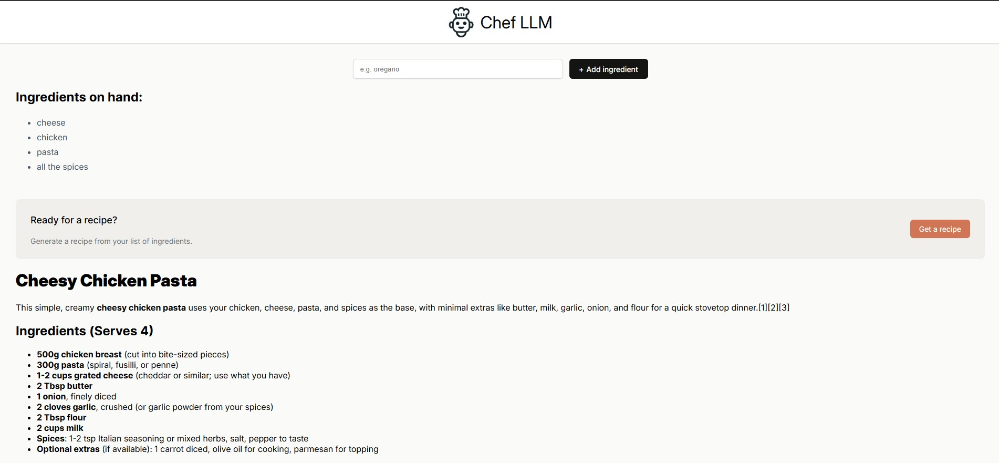

# 🚀 Mahadi's Portfolio

 
A modern, high-performance portfolio website built for **Md. Mahadi Hasan**, an AI Engineer and Full-Stack Developer. This project showcases my research in LLMs, big data pipelines, and scalable web applications.

## 🔗 Live Demo
👉 **[mahadih.netlify.app](https://mahadih.netlify.app)**

---

## 🛠️ Tech Stack

This portfolio is built with a focus on performance, animations, and clean code.

- **Frontend:** React 18, Vite
- **Styling:** Tailwind CSS
- **Animations:** Framer Motion
- **Icons:** Lucide React
- **Deployment:** Netlify

---

## ✨ Features

- **⚡ Fast & Responsive:** Built with Vite and Tailwind for lightning-fast load times and perfect mobile responsiveness.
- **🎨 Dynamic Animations:** Smooth entrance and scroll animations using Framer Motion.
- **🛠️ Skill Showcase:** Interactive skills section categorizing expertise in AI, Web, and Tools.
- **📂 Project Gallery:** Filterable project section highlighting my work in AI/ML, E-commerce, and SaaS.
- **📱 Contact Integration:** Fully functional contact form (powered by Formspree) and direct social links.

---

## 📂 Featured Projects

| Project | Category | Tech Stack |
| :--- | :--- | :--- |
| **Chef-LLM** | AI & Web | React, Perplexity AI, Vite |
| **Stock Forecasting** | Big Data & ML | Apache Spark, LSTM, Python |
| **Pyramid Tie** | E-commerce | HTML5, CSS3, JavaScript |
| **Higgs Boson PCA** | Big Data | Spark MLlib, PySpark |
| **LeadHarvest** | Web Extension | JavaScript, Chrome API |

---

## 🚀 Getting Started

Follow these steps to run the project locally on your machine.

### Prerequisites
Make sure you have **Node.js** installed.

### Installation

1. **Clone the repository**
   ```bash
   git clone [https://github.com/mahadi24t/portfolio-mahadi.git](https://github.com/mahadi24t/portfolio-mahadi.git)
   cd portfolio-mahadi