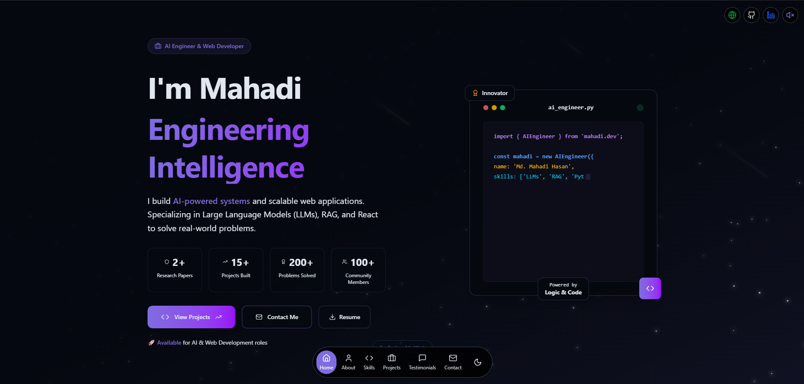

# ⚡ Md. Mahadi Hasan | AI Engineer & Web Developer


<br />



<br />

## 🚀 About The Project

Welcome to the personal portfolio of **Md. Mahadi Hasan**. 

This platform serves as a central hub demonstrating my expertise at the intersection of **Artificial Intelligence** and **Modern Web Engineering**. It showcases my research in Large Language Models (LLMs), big data pipelines using Apache Spark, and scalable full-stack applications.

Designed with a focus on performance and aesthetics, the site features a custom-built dark mode, smooth framer-motion animations, and a fully responsive layout.

### 🔗 **Live Demo:** [mahadih.netlify.app](https://mahadih.netlify.app)

---

## 🛠️ Technical Stack

I utilized a modern, component-driven architecture to ensure scalability and maintainability.

| Category | Technologies |
| :--- | :--- |
| **Frontend Core** | React 18, Vite, JavaScript (ES6+) |
| **Styling & UI** | Tailwind CSS, Lucide React Icons |
| **Animations** | Framer Motion (Complex gestures & scroll reveals) |
| **Form Handling** | React Hook Form + Formspree |
| **Deployment** | Netlify (CI/CD Pipeline) |

---

## 📂 Research & Projects

Key highlights from my work in AI and Software Engineering:

- **Chef-LLM:** An AI-powered culinary assistant using RAG and Perplexity AI.
- **Stock Market Forecasting:** A Hybrid CNN-LSTM model trained on 1.4M news headlines and historical stock data using Apache Spark.
- **Bengali Misinformation Detection:** A multimodal framework leveraging LLMs to detect fake news in low-resource languages (Published IEEE Paper).
- **High-Performance Architectures:** Experience with Scalable PCA on 11M+ record datasets (Higgs Boson).

---

## 💻 Getting Started locally

If you wish to explore the codebase or run a local version:

1. **Clone the repository**
   ```bash
   git clone [https://github.com/mahadi24t/portfolio-mahadi.git](https://github.com/mahadi24t/portfolio-mahadi.git)
   cd portfolio-mahadi